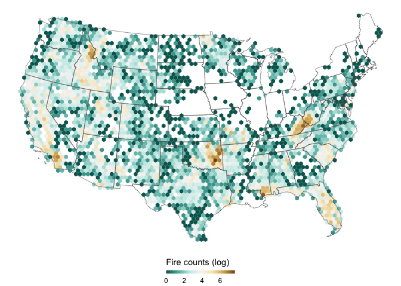
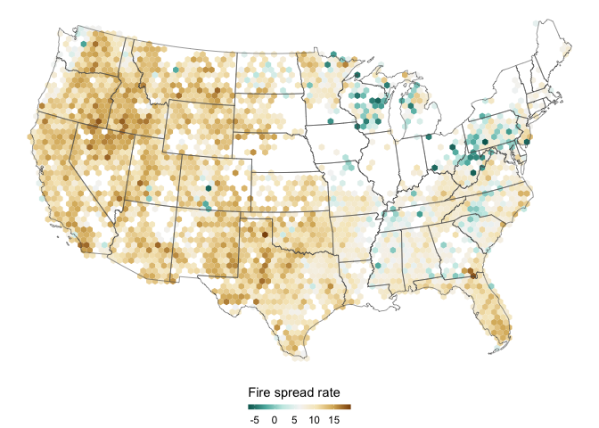
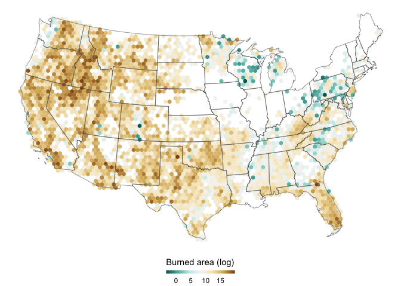
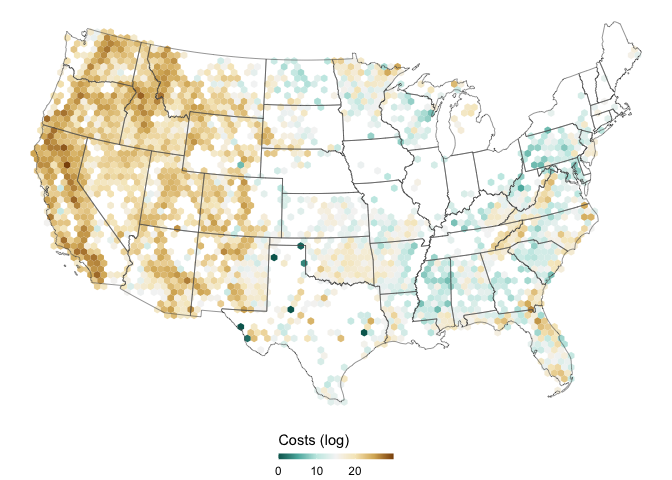
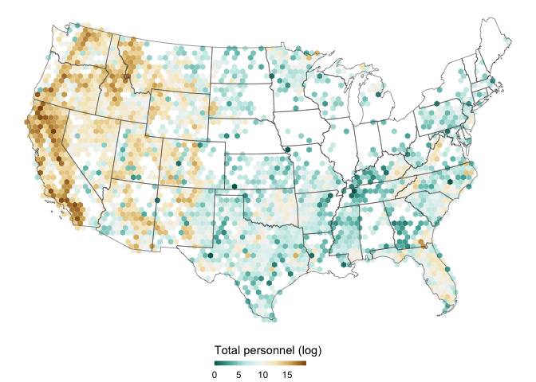
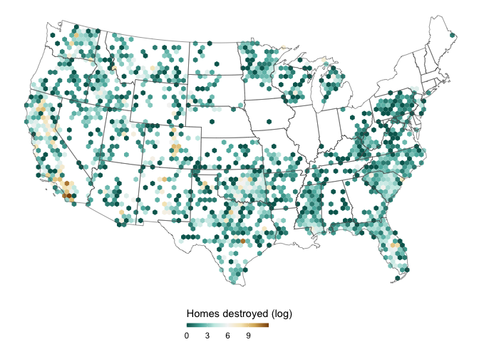
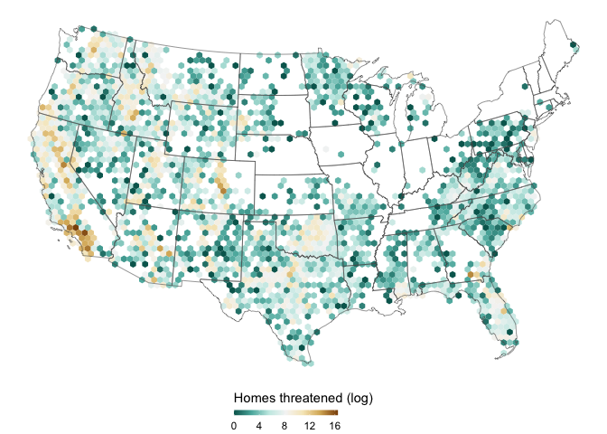

ICS 209 Plus Wildfires
================
Sara Altman
2020-06-05

  - [Fire Counts](#fire-counts)
  - [Figure 2](#figure-2)
      - [2a](#a)
      - [2b](#b)
      - [2c](#c)
      - [2d](#d)
      - [2e](#e)
      - [2f](#f)

``` r
# Libraries
library(tidyverse)
library(sf)

# Parameters
  # Atlas Equal Area (what the paper uses)
PROJECTION <- 
  "+proj=laea +lat_0=45 +lon_0=-100 +x_0=0 +y_0=0 +a=6370997 +b=6370997 +units=m +no_defs"
file_data <- here::here("data/ics209plus_wildfires.rds")
file_hexnet <- here::here("data/hexnet.rds")
#===============================================================================

wildfires <-
  file_data %>% 
  read_rds() %>% 
  filter(!state_name %in% c("Alaska", "Hawaii"))

hexnet <-
  file_hexnet %>% 
  read_rds()

states <-
  ussf::boundaries("state", projection = "longlat") %>% 
  st_transform(PROJECTION) %>% 
  filter(!NAME %in% c("Alaska", "Hawaii"))
```

``` r
map_var <- function(legend_label, ...) {
  hexnet %>% 
    right_join(
      wildfires %>% 
        st_drop_geometry() %>% 
        group_by(hex_id) %>% 
        summarize(...) %>% 
        rename_with(~ "var", .cols = 2),
      by = "hex_id"
    ) %>% 
    ggplot() +
    geom_sf(aes(fill = var), color = NA) +
    geom_sf(fill = NA, size = 0.2, data = states) +
    scale_fill_distiller(palette = 'BrBG', na.value = NA) +
    guides(
      fill = 
        guide_colorbar(
          title.position = "top", 
          barheight = 0.3
        )
    ) +
    labs(
      fill = legend_label
    ) +
    theme_void() +
    theme(legend.position = "bottom")
}
```

## Fire Counts

[Original](https://www.nature.com/articles/s41597-020-0403-0/figures/1)

``` r
map_var("Fire counts (log)", n = log2(n()))
```

<!-- -->

## Figure 2

[Original](https://www.nature.com/articles/s41597-020-0403-0/figures/2)

### 2a

``` r
map_var(
  legend_label = "Fire spread rate", 
  log2(max(wf_max_fsr, na.rm = TRUE))
)
```

<!-- -->

### 2b

``` r
map_var(
  legend_label = "Burned area (log)", 
  log2(sum(final_acres, na.rm = TRUE))
)
```

<!-- -->

### 2c

``` r
map_var(
  legend_label = "Costs (log)", 
  log2(sum(projected_final_im_cost, na.rm = TRUE))
)
```

<!-- -->

### 2d

``` r
map_var(
  legend_label = "Total personnel (log)", 
  log2(sum(total_personnel_sum, na.rm = TRUE))
)
```

<!-- -->

### 2e

``` r
map_var(
  legend_label = "Homes destroyed (log)", 
  log2(sum(str_destroyed_total, na.rm = TRUE))
)
```

<!-- -->

### 2f

``` r
map_var(
  legend_label = "Homes threatened (log)", 
  log2(sum(str_threatened_max, na.rm = TRUE))
)
```

<!-- -->
